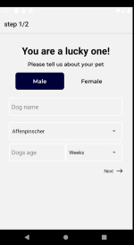
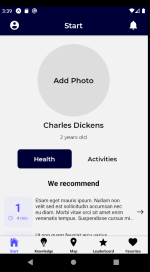
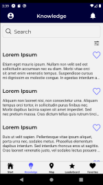

# DoggyApp

## Introduction

This is a mobile application for new dog owners developed by our team as part of the post gratuation project at [SALT](https://salt.study/).
 The app is developed with React Native (using [expo.io](https://expo.io/)) and Type Script for the front end. The data is fetched from the backend using Apollo GraphQl.
 The back end code is in separate repo available on GitHub [here](https://github.com/Danijela2019/DoggyApp-backEnd).

| |  |  |  | |

## How to use it
- **Clone the repo: https://github.com/Danijela2019/DoggyApp.git**
- **Go (cd) to doggy-app folder**
- **Install packages: npm install**
- **Run the 'expo start' command**
- **Several options are available on how to proview the application on localhost:19002**
- **In order to see the full functionality of the app the sever must be runnig. Instructions on how tu start the server are available [here](https://github.com/Danijela2019/DoggyApp-backEnd) repo.**
